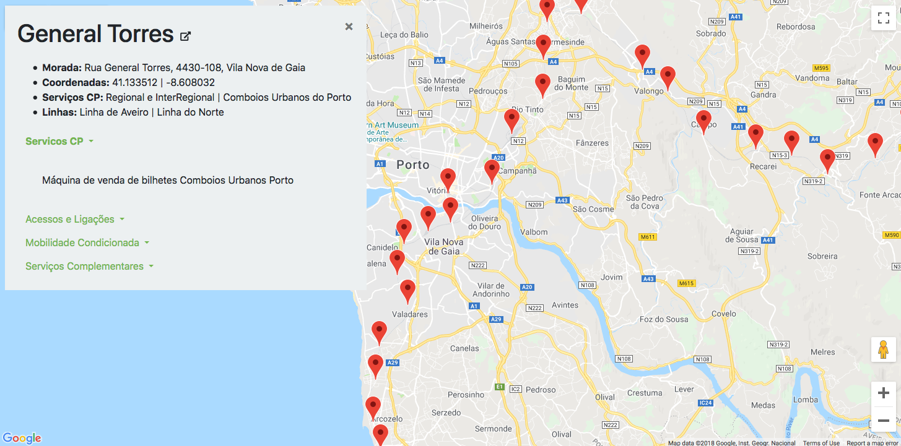

# CP-Stations-Map
Interactive map showing all train stations from CP (Comboio de Portugal).

## The idea
The idea came from [Comboio do Conhecimento](http://www.comboio-conhecimento.pt/), a CP project which allows portuguese university students to travel around Portugal for free during a week. This seems an excelent initiative, however there were no maps with all station's location. The main purpose of this project was to make the trip planning much easier by creating an interactive map with all train stations and some details from each station.

## Built With
* [Requests-HTML](https://html.python-requests.org/)
* [Google Maps Platform](https://cloud.google.com/maps-platform/)
* [jQuery](https://jquery.com/)
* [Bootstrap](https://getbootstrap.com/)
* [Font Awesome](https://fontawesome.com/)

## License
This project is licensed under the MIT License - see the [LICENSE.md](LICENSE.md) file for details
